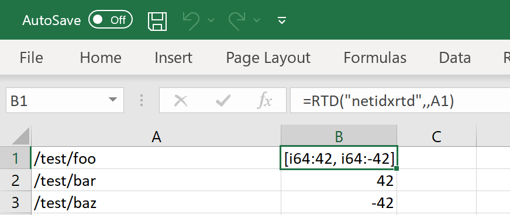

This is an Excel COM add-in that allows the `=RTD()` formula to pull in real time data from Netidx.

Say you have published some data, maybe from the shell publisher, and you want to show it to your boss, but "that commandline thing" or "that linux thing" is not something your boss does.
```bash
> netidx publisher --bind 192.168.0.0/24 --spn publish/ryouko.ryu-oh.org@RYU-OH.ORG
/test/foo|array|[42, -42]
/test/bar|i32|42
/test/baz|i32|-42
```

If you install the add-in on you bosses' machine, then he can pull that data into a cell in an Excel spreadsheet, and you can stop worrying about how to present results to pointy haired types and get your job done.



The key point is if a value in netidx updates, Excel will update almost immediatly, and your bosses pivot table will update too. csv exports are one step closer to dieing!
# Syntax

```
=RTD("netidxrtd",, PATH)
```

`PATH` can of course be a ref, or another formula, it's Excel, your boss knows Excel ... right?

# Performance 

Even if you subscribe to a lot of data, or you subscribe to data that updates quickly, Excel should remain responsive because RTDs are throttled, and all the netidx processing is happening on a background thread pool. For example here Excel is maxing out my wifi network by subscribing to the stress publisher, however it remains completely responsive. It's actually pulling in 2 million updates per second, and that's limited by the network, not the cpu.


# Building

You need a windows machine (obviously) probably windows 10 or above, but 8 might work. You need to install rust, the easiest way is to use rustup. You need to install git. Once you have those two things installed,

```bash
> git clone https://github.com/estokes/netidx-excel
> cd netidx-excel
> cargo build --release
```

The dll should be built in `target/release/netidx_excel.dll`

# Installing

To install you need to decide where you want the dll to live, it really doesn't matter, but I put it in `C:\Program Files\netidx-excel` on my machine. Then you need to run `regsvr32` on the dll as Administrator, that will set up the registry entries to register it as a proper COM server. So in an admin powershell,

```powershell
> mkdir 'C:\Program Files\netidx-excel'
> cp target\release\netidx_excel.dll 'C:\Program Files\netidx-excel'
> regsvr32 'C:\Program Files\netidx-excel\netidx_excel.dll'
```

The most common errors are `regsvr32` isn't in your path, and/or your shell is not running with admin rights.

# Limitations

- No write support; there's no real reason other than time, it's perfectly possible
- No publish support; again, no real reason, perfectly possible, but significantly more time than write
- No resolver list support; once again, time, no real problems with this
- I could remove the requirment for admin rights to install if people cared, but then you'd have to `regsvr32` it for every user on a machine

# Other

I programmed on windows for a WHOLE month so that you NEVER have too. Because trust me, you NEVER want to. But if you are curious about the dreams I had during that month, read this before bed [Inside COM+](https://www.thrysoee.dk/InsideCOM+/ch05c.htm). Really, don't do it. COM must have seemed like a good idea to someone at some point in history, right? Developers! Developers! Developers! ... Developers! I mean, GObject seems totally great now, really.
